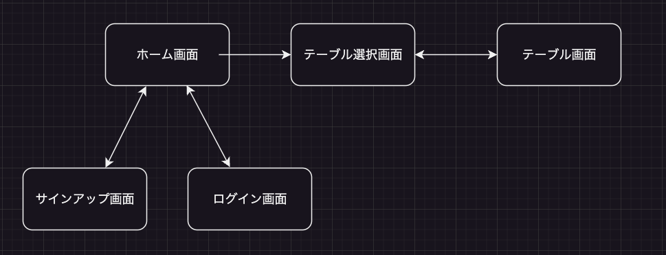

# README

## アプリケーション名	
DishMaker 

## アプリケーション概要	
食材を入力すると調理可能な料理を教えてくれるアプリケーションです。

## URL
https://dishmaker.onrender.com

## テスト用アカウント	
ログイン機能等を実装した場合は、ログインに必要な情報を記載。 
 Email:test@gmail.com 
 password:onakasuita4 

<b>Basic認証</b> 
ID:admin 
Pass:0141 

## 利用方法	
1. ユーザーのサインアップまたはログインする。
2. 「料理を作る」ボタンを押下する。
3. 冷蔵庫の名前を記入し作成ボタンを押下する。
4. ３で作成した冷蔵庫を選択する。
5. 食材を入力し追加ボタンを押下する。
6. 「食事を作る」ボタンを押下する。

## アプリケーションを作成した背景	
アプリケーション開発にあたり、今後生活の必需品となるであろうopenAIの技術を利用したアプリケーションを作成したいと考えました。
私事でありますが、プログラミングを学習を始めるにあたり自宅の滞在時間が長くなり、合わせて自炊する機会が増加しました。
その時に冷蔵庫の中身から作成できる料理を示してくれると便利そうと思い、一つの形に落とし込もうと考え作成に至りました。

## 実装した機能についての画像やGIFおよびその説明
後日記入

## 実装予定の機能	
後一つ食材を足す場合の食事作成ボタン 
その他細かく条件を絞るためのボタン

## データベース設計	

## 画面遷移図	

## 開発環境	
<b>言語</b>
Ruby 2.6.5

<b>API</b>
ChatGPT API

<b>gem</b>
devise
openai

## ローカルで作動させるための注意点
ローカルで起動させるためには環境変数にopenAIのAPIを記入する必要があります。

## 工夫したポイント
毎日のルーティングとしてこの質問をchatGPTにする場合を想定しアプリケーションを作成しました。
そこで必要になるのは2点あり、毎回記入する文章量を減らすことと使いやすいUIだと考えます。
記入する文章料を減らすためには、冷蔵庫の中身をデータベースに保存することによって、記入量を減らすことができます。
UIに関しては使いやすいをより重視して作成しました。まだ作成途中ですが、可能な限り少ないクリック数とひと目見ただけでわかりやすいレイアウトの作成に力を入れたいと考えています。

## 今後の予定
ChatGPTのAPIを利用したアプリケーションはこれだけに留まらず、生活を助けるために多方面からapiの活用に挑戦し続けたいと考えています。